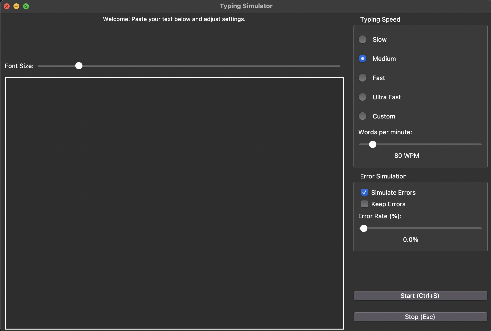

# Human Typing Simulator

A realistic human typing simulator that mimics natural typing patterns, including errors and speed variations.

## Features
- Realistic typing simulation with human-like patterns
- Configurable typing speed (20-1000+ WPM)
- Error simulation with adjustable rates
- Dark mode interface
- Speed presets from "Very Slow" to "Ultra Fast"
- Customizable error types and correction behavior

## Quick Install
